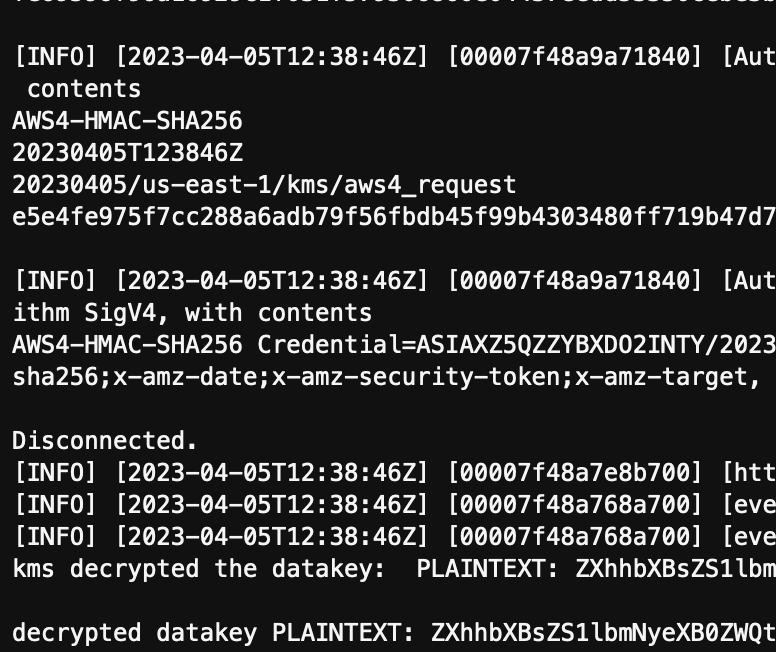
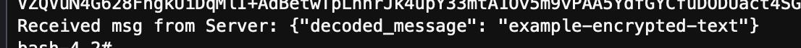

In this sample, we'd will create a simple C/S workload and run on Nitro Enclaves (EKS).

For Server Side, we will create a simple server to listen "Any of CID". It will wait and accept requests from Client. Client side will pass data s3 uri and KMS key to server.
Server will retrieve KMS key to decrypt data in Nitro Enclaves, implementating fully secure processing. 

** The KMS key is from other ACCOUNT, acting as TECH_Provider decryption key.


#### KMS Key Policy Update for IRSA (IAM Role for Service Account)
Assuming a KMS key being created, name "_KMS-KEY-A_".

1. Go to KMS console (region)
2. Click KMS Key
3. On "Key Policy" tab, click "Edit" button
4. Add below code snippet, with changing "<ACCOUNT_ID>" and "<IRSA_ROLE_NAME>"
```
{
    "Sid": "Allow use of IRSA",
    "Effect": "Allow",
    "Principal": {
        "AWS": "arn:aws:iam::<ACCOUNT_ID>:role/<IRSA_ROLE_NAME>"
    },
    "Action": [
        "kms:Encrypt",
        "kms:Decrypt",
        "kms:ReEncrypt*",
        "kms:GenerateDataKey*",
        "kms:DescribeKey"
    ],
    "Resource": "*"
}

```
5. Click "Save" button

------

Add S3 permission to IRSA
1. Go to IAM console
2. Click the IRSA_ROLE_NAME (customized by yourself)
3. Add inline policy
```
{
    "Version": "2012-10-17",
    "Statement": [
        {
            "Sid": "AllowAuroraToEncryptedDataBucket",
            "Effect": "Allow",
            "Action": [
                "s3:GetObject",
                "s3:ListBucket",
                "s3:GetObjectVersion",
                "s3:ListMultipartUploadParts"
            ],
            "Resource": [
                "arn:aws:s3:::privacy-computing-assets-us-east-1/*"
            ]
        }
    ]
}
```

------

### Prepare Sample test data
```
    cd examples/102-kmstools-example
    bash generate-and-upload-encrypted-data.sh <bucket_name> <kms_arn_id> <region>
    example: bash generate-and-upload-encrypted-data.sh privacy-computing-assets-us-east-1 arn:aws:kms:us-east-1:<account_id>:key/b4c01ff4-8a9f-4ee3-b3fc-xxxxxxxx us-east-1
```

When executed the script, encrypted data will be uploaded to S3 bucket.

------
Build "enclave_base" image
```
  docker build ./ -t "enclave_base"
```

Steps to build Server Side assets:

1. Build docker image

```
    cd 102-simple-example/enclavesServer
    docker build -t simple-ne-server:latest .
```

2. Create Enclaves Image File (EIF) for server image
```
   nitro-cli build-enclave --docker-uri simple-ne-server:latest --output-file simple-ne-server.eif 
```

3. Create Docker file for wrapping EIF file, this image will be pushed to ECR for EKS execution
```
   docker build -t simple-ne-server:latest_eif -f Dockerfile.eif
```

4. Create ECR repository for storing server EIF. Change REGION accordingly.
```
    aws ecr create-repository --repository-name simple-ne-server --region us-east-1 
```

5. Tag docker image and push. Please correct the ACCOUNT_ID and REGION
```
    aws ecr get-login-password --region <REGION> | docker login --username AWS --password-stdin <ACCOUNT_ID>.dkr.ecr.<REGION>.amazonaws.com
    docker tag simple-ne-server:latest_eif <ACCOUNT_ID>.dkr.ecr.<REGION>.amazonaws.com/simple-ne-server:latest_eif 
    docker push <ACCOUNT_ID>.dkr.ecr.<REGION>.amazonaws.com/simple-ne-server:latest_eif
```

6. Change the YAML file for running Server-app on EKS
```
    #Change line 25 to point to your own IMAGE uri.
    - image: <ACCOUNT_ID>.dkr.ecr.<REGION>.amazonaws.com/simple-ne-server:latest_eif
```

7. Deploy Server-app to EKS
```
   # Update ~/.kube/config for interacting with EKS
   # This command can be found in CloudFormation >> Output tab
   aws eks update-kubeconfig --name cluster-eks_enclaves --region <REGION> --role-arn arn:aws:iam::<ACCOUNT_ID>:role/EKS-Enclaves-ClusterAdminRole<SUFFIX>
   
   kubectl apply -f deploy.yaml
```

8. Check the log
```
   kubectl get pods -n fl # you can find a pod name like "server-xxxx-xxxx"
   kubectl logs -f -l app=server -n fl
```
   

9. About the "Enclave CID / context ID"
```
   Assuming only single Enclave running on an instance, so currently specifically assign "99999" as enclave ID, you can check the "run.sh".
   While passing the CID (99999) as paramater to client deploy.yaml.
```


Steps to build Client Side assets:
1. Build docker image

```
    cd 102-simple-example/enclavesClient
    docker build -t simple-ne-client:latest .
```

2. Create ECR repository for storing server EIF. Change REGION accordingly.
```
    aws ecr create-repository --repository-name simple-ne-client --region us-east-1 
```

5. Tag docker image and push. Please correct the ACCOUNT_ID and REGION
```
    aws ecr get-login-password --region <REGION> | docker login --username AWS --password-stdin <ACCOUNT_ID>.dkr.ecr.<REGION>.amazonaws.com
    docker tag simple-ne-client:latest <ACCOUNT_ID>.dkr.ecr.<REGION>.amazonaws.com/simple-ne-client:latest
    docker push <ACCOUNT_ID>.dkr.ecr.<REGION>.amazonaws.com/simple-ne-client:latest
```

6. Change the YAML file for running Client-app on EKS
```
    #Change line 25 to point to your own IMAGE uri.
    - image: <ACCOUNT_ID>.dkr.ecr.<REGION>.amazonaws.com/simple-ne-client:latest
```

7. Deploy Clien-app to EKS
```
   # Update ~/.kube/config for interacting with EKS
   # This command can be found in CloudFormation >> Output tab
   aws eks update-kubeconfig --name cluster-eks_enclaves --region <REGION> --role-arn arn:aws:iam::<ACCOUNT_ID>:role/EKS-Enclaves-ClusterAdminRole<SUFFIX>
```

   Please review and change the values accordingly in deploy.yaml
```
        env:
        - name: CID
          value: "99999"
        - name: ENCRYPTED_DATA_S3_URI
          value: "s3://privacy-computing-assets-us-east-1/encrypted_data.txt"   # sample s3 uri of encrypted data
        - name: KMS_KEY_ID
          value: "arn:aws:kms:us-east-1:536704830979:key/b4c01ff4-8a9f-4ee3-b3fc-xxxxx"  # ARN of KMS KEY
        - name: REGION
          value: "us-east-1"
```
    
    Execute the deployment for client
```   
   kubectl apply -f deploy.yaml
```

8. Check the log
```
   kubectl get pods -n fl # you can find a pod name like "client-xxxx-xxxx"
   kubectl logs -f -l app=client -n fl
```


### Finally you should see something from Client & Server console, as below:
Server: 
```
    Payload JSON is : {"msg":"hello"}
    Message sent back to client
```

Client: 
```
   Received msg from Server: {"decoded_message": "example-encrypted-text"}
```
   