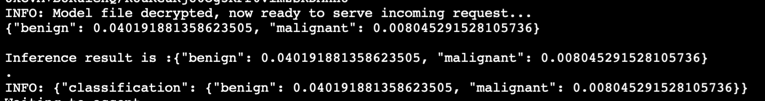

### Scenarios background
In this example, we will use HCLS sample - Breast Cancer Classification. We will use a pretrained model to predict if breast got cancer.

There is collaboration between Medical Tech and Medical Institution, aiming to improve accuracy and efficiency for medical data prediction,
eliminating human cost. There are concerns from both sides - Medical Tech and Medical Institution.

Medical Institution: Data should retain in private zone (i.e. AWS account).
Medical Tech: A pretrained model is deliverables to medical institution, but need a way to ensure the protected intellectual property (model) is secure.

Under this circumstance, to fully utilize _*AWS Nitro Enclaves and KMS*_ can resolve the need from both sides.

#### Step 1 - Provision EC2 with enabling Nitro Enclaves
##### Region please select us-east-2
1. If you are now in Cloud9 environment, go to "cloudformation_yaml" folder, right click and download file "nitro-enclave-demo.yaml"
2. Go to "CloudFormation" on AWS Console, and click "Create Stack" - "With new Resources (Standard)"
3. Select "Upload a template file", choose and upload "nitro-enclave-demo.yaml".
4. Click Next till Finish (need to tick checkbox in last step to acknowledge)
5. Wait for 10 mins for resource creation.

#### Step 2 - Get KMS key ARN
This KMS key will be used to encrypt/decrypt machine learning model in this example.
1. Go to KMS console (region), select "Customer managed keys" on left banner
2. Click KMS Key "EnclaveKMSkey"
3. Save the "ARN" from "General Information" section


#### Step 3 - Connect EC2 instance
1. Go to EC2 on AWS Console, there will be an instance named like "xxxxx-NitroEnclaveInstance"
2. Select the instance, and click "Connect" on TOP-RIGHT.
3. By default under "Session Manager" tab, click "Connect" button


#### Step 4 - EC2 Configuration
Coming steps are to configure EC2 instance for Nitro-Enclaves and related tools
1. Now logged in EC2 instance, execute below commands in terminal
```
   sudo amazon-linux-extras install aws-nitro-enclaves-cli -y
   sudo yum install aws-nitro-enclaves-cli-devel -y
   nitro-cli --version
   
   sudo yum install git -y
   sudo usermod -aG ne ssm-user
   sudo usermod -aG docker ssm-user
   sudo systemctl start docker && sudo systemctl enable docker
```
2. Configure CPU and RAM for nitro enclave allocator
```
    ALLOCATOR_YAML=/etc/nitro_enclaves/allocator.yaml
    MEM_KEY=memory_mib
    DEFAULT_MEM=20480
    sudo sed -r "s/^(\s*${MEM_KEY}\s*:\s*).*/\1${DEFAULT_MEM}/" -i "${ALLOCATOR_YAML}"
    sudo systemctl start nitro-enclaves-allocator.service && sudo systemctl enable nitro-enclaves-allocator.service
```

#### Step 5 - Build base image
1. Run below commands on EC2 to checkout the code
```
    git clone xxxxxxx 
```
2. Build base image
```
   cd examples/103-breast-cancer-classifier-ec2-example
   sudo docker build ./ -t enclave_base
```
3. Pass KMS ARN to encrypt pretrained model
```
   cd enclaveServer
   pip3 install -r requirements.txt
   python3 ./encrypt_model.py --kms_arn=<input the KMS ARN you get from step 2>
   
   # move out the original file to avoid overpackaging
   mv ./breast_cancer_classifer/models/ImageOnly__ModeImage_weights.p ../
```
5. Build the Server-side image & EIF (encalve image file)
```
   export IMAGE_NAME="ne-breast-cancer-classifier"
   sudo docker build ./ -t ${IMAGE_NAME}:latest && sudo nitro-cli build-enclave --docker-uri ${IMAGE_NAME}:latest --output-file ${IMAGE_NAME}.eif
```
6. Run EIF file and output console log
```
   # change the size if need, the size should be 4 times of size of Docker image
   sudo nitro-cli run-enclave --cpu-count 2 --memory 18000 --eif-path ${IMAGE_NAME}.eif --attach-console --debug
```


#### Step 6 - Encrypt images for demo
```
  # Please start another terminal, you can do that from EC2 - Connect - Session Manager
  cd ../enclaveClient
  
  # Current folder: examples/103-breast-cancer-classifier-ec2-example/enclaveClient
  # Change region accordingly (depends on your KMS location)
  export CFN_REGION=us-east-2
 
  # Encrypt images for demo
  python3 ./envelope-encryption/encryptor.py --filePath ./images/0_L_CC.png --cmkId alias/EnclaveKMSkey --region $CFN_REGION

  # Verify that the output contains: file encrypted? True
```

#### Step 7 - Create VSock Proxy
Vsock proxy is the only way for communication between Parent EC2 and Nitro-enclaves.
```
    export CFN_REGION=us-east-2
    vsock-proxy 8001 "kms.$CFN_REGION.amazonaws.com" 443 --config ../enclaveServer/vsock-proxy-config.yaml &
```

#### Step 8 - Raise request for inference
```
    python3 client.py --filePath ./images/0_L_CC.png.encrypted | jq -C '.'
```


---
### Log from NitroEnclave (Server) side
By default, the ml model will be decrypted ONLY ONCE when the request initially reached.



### Log from Client side


### Summary
Now you can see the prediction from pretrained model - possibility of benign or malignant.
Same logic and flow can be applied to similar intellectual Property protection and data usage.


#### At your end (KEY_USER)
1. At your end, goto IAM page on AWS console. 
2. For this demo, the IAM role being used is similar "SSM-access-xxxxx"
3. Click the role
4. Edit the IAM policy - "Allow-EC2Instance-KMS-Encrypt"
5. Add below snippet
```
        {
            "Sid": "AllowExternalKMSAccess",
            "Effect": "Allow",
            "Action": [
                "kms:Encrypt",
                "kms:Decrypt",
                "kms:ReEncrypt*",
                "kms:GenerateDataKey*",
                "kms:DescribeKey"
            ],
            "Resource": "<ARN_of_KMS_key_from_other_account>"
        }
```
6. Click "Save"


#### At remote end (KEY_OWNER)
1. Locate to remote KMS key (on other account)
2. Get the IAM role from KEY_USER
3. Edit "Key policy" with adding belwo snippet
```
        {
            "Sid": "Allow use of other account",
            "Effect": "Allow",
            "Principal": {
                "AWS": "<ARN_of_IAM_role_from_KEY_USER>"
            },
            "Action": [
                "kms:Encrypt",
                "kms:Decrypt",
                "kms:ReEncrypt*",
                "kms:GenerateDataKey*",
                "kms:DescribeKey"
            ],
            "Resource": "*"
        }
```
4. click "Save"

----
### Clean up
1. Go to AWS Console Cloudformation
2. Select stack of this demo, click "Delete".