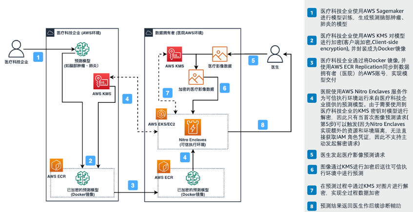
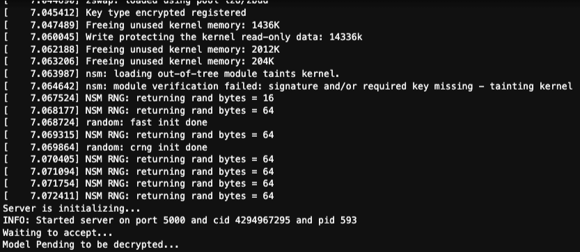
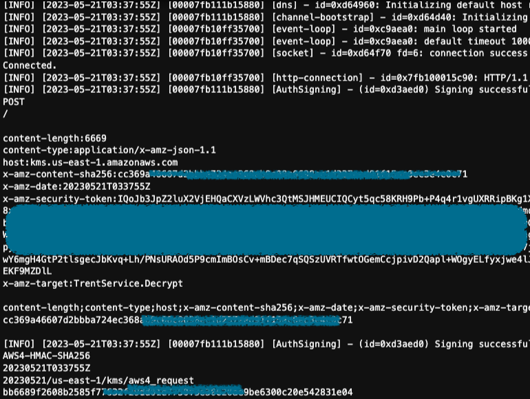
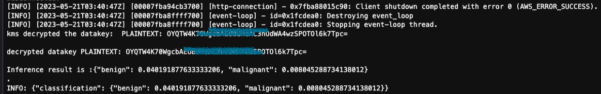
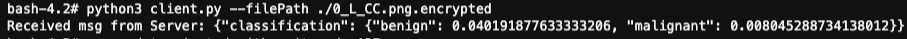

### Scenarios background

In this example, we will use HCLS sample - Breast Cancer Classification. We will use a pretrained model to predict if
breast got cancer.

There is collaboration between Medical Tech and Medical Institution, aiming to improve accuracy and efficiency for
medical data prediction, eliminating human cost. There are concerns from both sides - Medical Tech and Medical
Institution.

Medical Institution: Data should retain in private zone (i.e. AWS account). Medical Tech: A pretrained model is
deliverables to medical institution, but need a way to ensure the protected intellectual property (model) is secure.

Under this circumstance, to fully utilize _*AWS Nitro Enclaves and KMS*_ can resolve the need from both sides.

### Overview



#### KMS Key Policy Update for IRSA (IAM Role for Service Account)

Assuming a KMS key being created, name "_KMS-KEY-A_".

1. Go to KMS console (region)
2. Click KMS Key
3. On "Key Policy" tab, click "Edit" button
4. Add below code snippet, with changing "<ACCOUNT_ID>" and "<IRSA_ROLE_NAME>"

```
{
    "Sid": "Allow use of IRSA",
    "Effect": "Allow",
    "Principal": {
        "AWS": "arn:aws:iam::<ACCOUNT_ID>:role/<IRSA_ROLE_NAME>"
    },
    "Action": [
        "kms:Encrypt",
        "kms:Decrypt",
        "kms:ReEncrypt*",
        "kms:GenerateDataKey*",
        "kms:DescribeKey"
    ],
    "Resource": "*"
}

```

5. Click "Save" button

------

#### Add S3 permission to IRSA

1. Go to IAM console
2. Click the IRSA_ROLE_NAME (customized by yourself)
3. Add inline policy

```
{
    "Version": "2012-10-17",
    "Statement": [
        {
            "Sid": "AllowAuroraToEncryptedDataBucket",
            "Effect": "Allow",
            "Action": [
                "s3:GetObject",
                "s3:ListBucket",
                "s3:GetObjectVersion",
                "s3:ListMultipartUploadParts"
            ],
            "Resource": [
                "arn:aws:s3:::privacy-computing-assets-us-east-1/*"
            ]
        }
    ]
}
```

------

#### Build "enclave_base" image

##### This can be skipped if you ran 101/102

```shell
  cd examples/103-breast-cancer-classifier-eks-example
  docker build ./ -t "enclave_base"
```

#### Steps to build Server Side assets:

1. Use KMS to encrypt AI Model (intellectual Property). Go into Cloud9 environment and pass KMS_ARN for encrypting model

```shell

   cd examples/103-breast-cancer-classifier-eks-example/enclaveServer
   pip3 install -r requirements.txt
   python3 ./encrypt_model.py --kms_arn=<input the KMS ARN you get from step 2>
   
   # move out the original file to avoid overpackaging
   mv ./breast_cancer_classifier/models/ImageOnly__ModeImage_weights.p ../

```

2. Build docker image

```shell
    cd 103-breast-cancer-classifier-eks-example/enclaveServer
    docker build -t breast-cancer-classifier:latest .
```

3. Create Enclaves Image File (EIF) for server image

```shell
   nitro-cli build-enclave --docker-uri breast-cancer-classifier:latest --output-file breast-cancer-classifier.eif
```

4. Create Docker file for wrapping EIF file, this image will be pushed to ECR for EKS execution

```shell
   docker build -t breast-cancer-classifier:latest_eif -f Dockerfile.eif .
```

5. Create ECR repository for storing server EIF. Change REGION accordingly.

```
    aws ecr create-repository --repository-name breast-cancer-classifier --region us-east-1 
```

6. Tag docker image and push. Please correct the ACCOUNT_ID and REGION

```
    aws ecr get-login-password --region <REGION> | docker login --username AWS --password-stdin <ACCOUNT_ID>.dkr.ecr.<REGION>.amazonaws.com
    docker tag breast-cancer-classifier:latest_eif <ACCOUNT_ID>.dkr.ecr.<REGION>.amazonaws.com/breast-cancer-classifier:latest_eif
    docker push <ACCOUNT_ID>.dkr.ecr.<REGION>.amazonaws.com/breast-cancer-classifier:latest_eif
```

7. Change the YAML file for running Server-app on EKS

```
    #Change line 25 to point to your own IMAGE uri.
    - image: <ACCOUNT_ID>.dkr.ecr.<REGION>.amazonaws.com/breast-cancer-classifier:latest_eif
```

8. Deploy Server-app to EKS

```
   # Update ~/.kube/config for interacting with EKS
   # This command can be found in CloudFormation >> Output tab
   aws eks update-kubeconfig --name cluster-eks_enclaves --region <REGION> --role-arn arn:aws:iam::<ACCOUNT_ID>:role/EKS-Enclaves-ClusterAdminRole<SUFFIX>
   
   kubectl apply -f deploy.yaml
```

#### Steps to build Client Side assets:

1. Build docker image

```shell
    cd ../enclaveClient
    # Current location should be "103-breast-cancer-classifier-eks-example/enclaveClient"
    docker build -t breast-cancer-classifier-client:latest .
```

2. Create ECR repository for storing server EIF. Change REGION accordingly.

```shell
    aws ecr create-repository --repository-name breast-cancer-classifier-client --region us-east-1 
```

3. Tag docker image and push. Please correct the ACCOUNT_ID and REGION

```shell
    aws ecr get-login-password --region <REGION> | docker login --username AWS --password-stdin <ACCOUNT_ID>.dkr.ecr.<REGION>.amazonaws.com
    docker tag breast-cancer-classifier-client:latest <ACCOUNT_ID>.dkr.ecr.<REGION>.amazonaws.com/breast-cancer-classifier-client:latest
    docker push <ACCOUNT_ID>.dkr.ecr.<REGION>.amazonaws.com/breast-cancer-classifier-client:latest
```

4. Change the YAML file for running Client-app on EKS

```shell
    #Change line 25 to point to your own IMAGE uri.
    - image: <ACCOUNT_ID>.dkr.ecr.<REGION>.amazonaws.com/breast-cancer-classifier-client:latest
```

5. Review and change values in Deployment.yaml

```yaml
        env:
          - name: CID
            value: "99999"
          - name: KMS_KEY_ID
            value: "arn:aws:kms:us-east-1:536704830979:key/b4c01ff4-8a9f-4ee3-b3fc-xxxxx"  # ARN of KMS KEY
          - name: REGION
            value: "us-east-1"
```

6. Deploy Client-app to EKS

```shell
   # Update ~/.kube/config for interacting with EKS
   # This command can be found in CloudFormation >> Output tab
   aws eks update-kubeconfig --name cluster-eks_enclaves --region <REGION> --role-arn arn:aws:iam::<ACCOUNT_ID>:role/EKS-Enclaves-ClusterAdminRole<SUFFIX>
   kubectl apply -f deploy.yaml
```

#### Verify if Encrypted Model and classification feature works

1. Get into pod from Server side

```shell

    # you can find a pod name like "server-xxxx-xxxx"
    # Please DO REMEMBER the node, because Client need to pick same one
    kubectl get pods -n fl -o wide 
    
    # get into pod to manually execution
    kubectl exec -it pod/server-xxxx -n fl -- /bin/bash
```

2. When jumps in server pod, run below commands to spin up Nitro Enclaves EIF

```shell
   cd /app
   bash run.sh
   
   # then wait 1-2 mins, you will see similar log as below
```



3. Get into pod from Client side. Start a new terminal, and jump into client (same node as server's)

```shell
   kubectl get pods -n fl # you can find a pod name like "client-xxxx-xxxx"
   kubectl exec -it pod/client-xxxx -n fl -- /bin/bash
```

4. When jumps in client pod, there will be 2 steps

```shell
   cd /app
   
   #1 - Encrypt the prepared image
   export AWS_DEFAULT_REGION=$REGION
   python3 ./encryptor.py --filePath ./0_L_CC.png --cmkId alias/EnclaveKMSKey --region $AWS_DEFAULT_REGION
   
   # Verify that the output contains: file encrypted? True
   
   #2 - Trigger the classification and model decryption
   python3 client.py --filePath ./0_L_CC.png.encrypted | jq -C '.'
   
```

5. Then from Server side will receive message and conduct the KMS decrypting, similar log as below.
   

6. Finally we will see response from server and client side.
    1. Log from NitroEnclave (Server) side
       

    2. Log from Client side
       

### Summary

Now you can see the prediction from pretrained model - possibility of benign or malignant. Same logic and flow can be
applied to similar intellectual Property protection and data usage.

### How to implement cross account IAM/KMS for Nitro Enclaves ?

#### At your end (KEY_USER)

1. At your end, goto IAM page on AWS console.
2. For this demo, the IAM role being used is similar "SSM-access-xxxxx"
3. Click the role
4. Edit the IAM policy - "Allow-EC2Instance-KMS-Encrypt"
5. Add below snippet

```
        {
            "Sid": "AllowExternalKMSAccess",
            "Effect": "Allow",
            "Action": [
                "kms:Encrypt",
                "kms:Decrypt",
                "kms:ReEncrypt*",
                "kms:GenerateDataKey*",
                "kms:DescribeKey"
            ],
            "Resource": "<ARN_of_KMS_key_from_other_account>"
        }
```

6. Click "Save"

#### At remote end (KEY_OWNER)

1. Locate to remote KMS key (on other account)
2. Get the IAM role from KEY_USER
3. Edit "Key policy" with adding belwo snippet

```
        {
            "Sid": "Allow use of other account",
            "Effect": "Allow",
            "Principal": {
                "AWS": "<ARN_of_IAM_role_from_KEY_USER>"
            },
            "Action": [
                "kms:Encrypt",
                "kms:Decrypt",
                "kms:ReEncrypt*",
                "kms:GenerateDataKey*",
                "kms:DescribeKey"
            ],
            "Resource": "*"
        }
```

4. click "Save"

----

### Clean up

1. Go to AWS Console Cloudformation
2. Select stack of this demo, click "Delete".
3. If you hit error related to IAM role, please check the role "*NodeGroupRole", and manually remove the SSM permission
   then retry.