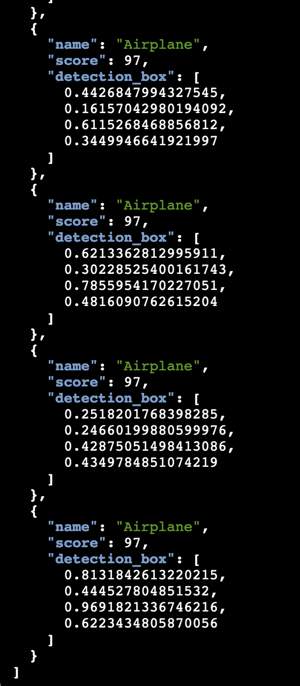

In this example, we will use EC2 to conduct the Object Detection in Nitro Enclaves.

### Scenarios background
In real world, technical provider companies owns commercial assets like AIML models, which is critical to business. They will not directly dispatch and expose to customers.
Meantime, customers who owns data need advanced technique and solution to conduct data analysis (like in HCLS, AI-assitant medical diagnosis).

Under this circumstance, to fully utilize AWS Nitro Enclaves and KMS can resolve the need from both sides.

Thi example will use Object Detection model for Airline to demo how to encrypt model in packaging stage, and decrypt model within NitroEnclaves before inference.


#### Step 1 - Provision EC2 with enabling Nitro Enclaves
##### Region please select us-east-2
1. If you are now in Cloud9 environment, go to "cloudformation_yaml" folder, right click and download file "nitro-enclave-demo.yaml"
2. Go to "CloudFormation" on AWS Console, and click "Create Stack" - "With new Resources (Standard)"
3. Select "Upload a template file", choose and upload "nitro-enclave-demo.yaml".
4. Click Next till Finish (need to tick checkbox in last step to acknowledge)
5. Wait for 10 mins for resource creation.

#### Step 2 - Get KMS key ARN
This KMS key will be used to encrypt/decrypt machine learning model in this example.
1. Go to KMS console (region), select "Customer managed keys" on left banner
2. Click KMS Key "EnclaveKMSkey"
3. Save the "ARN" from "General Information" section


#### Step 3 - Connect EC2 instance
1. Go to EC2 on AWS Console, there will be an instance named like "xxxxx-NitroEnclaveInstance"
2. Select the instance, and click "Connect" on TOP-RIGHT.
3. By default under "Session Manager" tab, click "Connect" button


#### Step 4 - EC2 Configuration
Coming steps are to configure EC2 instance for Nitro-Enclaves and related tools
1. Now logged in EC2 instance, execute below commands in terminal
```
   sudo amazon-linux-extras install aws-nitro-enclaves-cli -y
   sudo yum install aws-nitro-enclaves-cli-devel -y
   nitro-cli --version
   
   sudo yum install git -y
   sudo usermod -aG ne ssm-user
   sudo usermod -aG docker ssm-user
   sudo systemctl start docker && sudo systemctl enable docker
```
2. Configure CPU and RAM for nitro enclave allocator
```
    ALLOCATOR_YAML=/etc/nitro_enclaves/allocator.yaml
    MEM_KEY=memory_mib
    DEFAULT_MEM=20480
    sudo sed -r "s/^(\s*${MEM_KEY}\s*:\s*).*/\1${DEFAULT_MEM}/" -i "${ALLOCATOR_YAML}"
    sudo systemctl start nitro-enclaves-allocator.service && sudo systemctl enable nitro-enclaves-allocator.service
```

#### Step 5 - Build base image
1. Run below commands on EC2 to checkout the code
```
    git clone xxxxxxx 
```
2. Build base image
```
   cd examples/103-object-detection-ec2-exaple
   sudo docker build ./ -t enclave_base
```
3. Download pretrained demo model
```
    cd server
    
    # Current folder: examples/103-object-detection-ec2-exaple/server
    
    mkdir -p models/faster_rcnn_openimages_v4_inception_resnet_v2_1 && cd models/
    wget -O tensorflow-model.tar.gz https://tfhub.dev/google/faster_rcnn/openimages_v4/inception_resnet_v2/1?tf-hub-format=compressed
    tar -xvf tensorflow-model.tar.gz -C faster_rcnn_openimages_v4_inception_resnet_v2_1
```
4. Pass KMS ARN to encrypt the model
```
   pip3 install -r requirements.txt
   python3 ./encrypt_model.py --kms_arn=<input the KMS ARN you get from step 2>
   
   # move out the original file to avoid overpackaging
   mv ./models/faster_rcnn_openimages_v4_inception_resnet_v2_1/saved_model.pb ../
```
5. Build the Server-side image & EIF (encalve image file)
```
   sudo docker build ./ -t nitro-enclave-container-ai-ml:latest && sudo nitro-cli build-enclave --docker-uri nitro-enclave-container-ai-ml:latest --output-file nitro-enclave-container-ai-ml.eif
```
6. Run EIF file and output console log
```
   sudo nitro-cli run-enclave --cpu-count 2 --memory 14336 --eif-path nitro-enclave-container-ai-ml.eif --attach-console
```


#### Step 6 - Encrypt images for demo
```
  cd ../client
  
  # Current folder: examples/103-object-detection-ec2-exaple/client
 
  # Encrypt images for demo
  python3 ./envelope-encryption/encryptor.py --filePath ./images/air-show.jpg --cmkId alias/EnclaveKMSkey --region $CFN_REGION

  # Verify that the output contains: file encrypted? True
```

#### Step 7 - Create VSock Proxy
Vsock proxy is the only way for communication betewwn Parent EC2 and Nitro-enclaves.
```
    export CFN_REGION=us-east-2
    vsock-proxy 8001 "kms.$CFN_REGION.amazonaws.com" 443 --config vsock-proxy-config.yaml &
```

#### Step 8 - Raise request for inference
```
    python3 client.py --filePath ./images/air-show.jpg.encrypted | jq -C '.'
```


---
### Log from NitroEnclave (Server) side
By default, the ml model will be decrypted ONLY ONCE when the request initially reached.


### Log from Client side



### Summary
Same logic is applicable for using KMS key from other AWS account, only need to add 2 more steps as below.
You will need to confirm the arn of KMS key from other AWS account!!

#### At your end (KEY_USER)
1. At your end, goto IAM page on AWS console. 
2. For this demo, the IAM role being used is similar "SSM-access-xxxxx"
3. Click the role
4. Edit the IAM policy - "Allow-EC2Instance-KMS-Encrypt"
5. Add below snippet
```
        {
            "Sid": "AllowExternalKMSAccess",
            "Effect": "Allow",
            "Action": [
                "kms:Encrypt",
                "kms:Decrypt",
                "kms:ReEncrypt*",
                "kms:GenerateDataKey*",
                "kms:DescribeKey"
            ],
            "Resource": "<ARN_of_KMS_key_from_other_account>"
        }
```
6. Click "Save"


#### At remote end (KEY_OWNER)
1. Locate to remote KMS key (on other account)
2. Get the IAM role from KEY_USER
3. Edit "Key policy" with adding belwo snippet
```
        {
            "Sid": "Allow use of other account",
            "Effect": "Allow",
            "Principal": {
                "AWS": "<ARN_of_IAM_role_from_KEY_USER>"
            },
            "Action": [
                "kms:Encrypt",
                "kms:Decrypt",
                "kms:ReEncrypt*",
                "kms:GenerateDataKey*",
                "kms:DescribeKey"
            ],
            "Resource": "*"
        }
```
4. click "Save"

----
### Clean up
1. Go to AWS Console Cloudformation
2. Select stack of this demo, click "Delete".